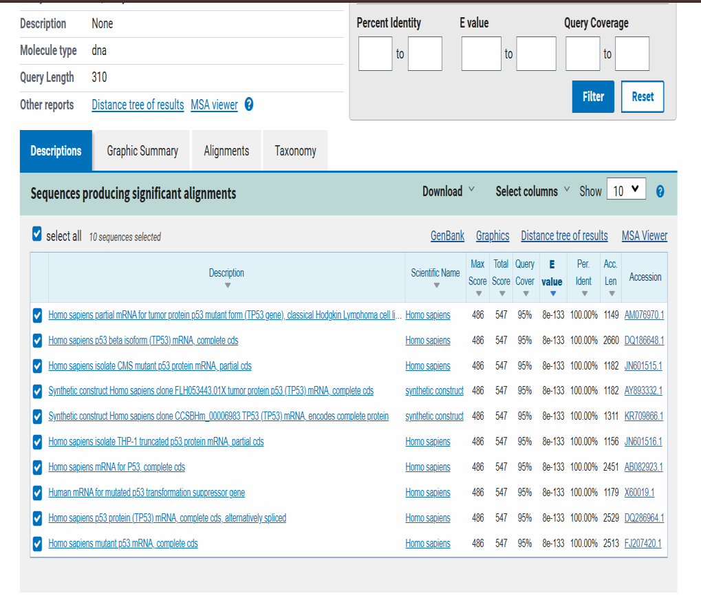
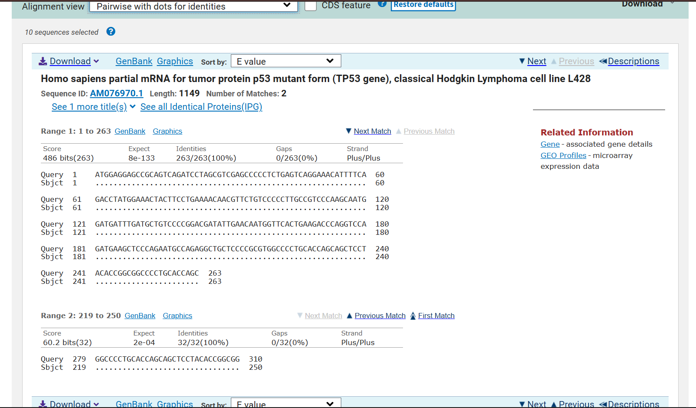
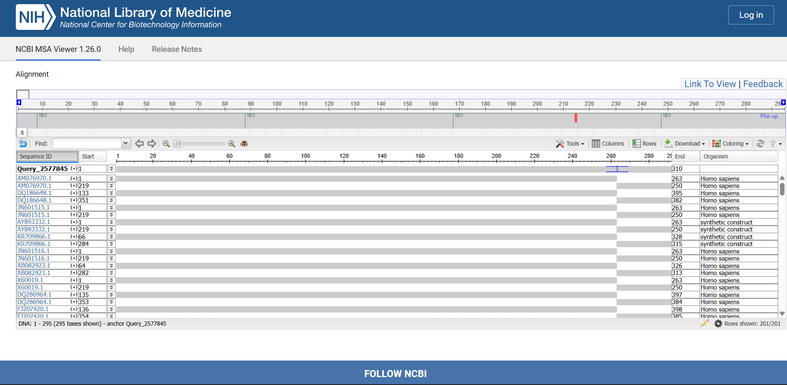

<div align="center">

# 🧬 TP53 Sequence Analysis Pipeline

### Bioinformatics Workflow for TP53 Nucleotide Sequence Characterization and Evolutionary Interpretation


<br>


<br>

### Bioinformatics × Genomics × Sequence Analysis

</div>

---

# 🌟 Project Snapshot

<div align="center">

| 🧬 Gene | 🎯 Identity | 📊 E-value | 🌍 Species |
|----------|----------|----------|----------|
| TP53 | 100% | 8e-133 | Homo sapiens |

</div>

---

# 🌍 Overview

This repository presents a comprehensive bioinformatics workflow for the characterization and evolutionary analysis of the **TP53 tumor suppressor gene** using widely adopted computational biology tools.

The project integrates:

- 🔍 Sequence Similarity Searching
- 🧬 Pairwise Alignment
- 📊 Multiple Sequence Alignment (MSA)
- 🌳 Phylogenetic Analysis
- 🧠 Evolutionary Interpretation

to investigate sequence conservation, biological significance, and evolutionary relationships associated with TP53.

The workflow demonstrates practical applications of computational biology techniques for molecular sequence characterization and genomic interpretation.

---

# 🎯 Research Objective

To analyze the TP53 nucleotide sequence using NCBI BLASTn and associated bioinformatics tools for:

✅ Sequence identification

✅ Similarity assessment

✅ Pairwise sequence alignment

✅ Multiple sequence alignment

✅ Phylogenetic characterization

✅ Evolutionary interpretation

---

# 🧬 Sequence Information

| Parameter | Value |
|-----------|-----------|
| Gene | TP53 |
| Sequence Type | Nucleotide |
| Database | NCBI |
| Similarity Search Tool | BLASTn |
| MSA Tool | NCBI MSA Viewer |
| Top Hit Accession | AM076970.1 |
| Species | Homo sapiens |

---

# ⚙️ Bioinformatics Workflow


---

# 📥 Sequence Retrieval

The TP53 nucleotide sequence was retrieved in FASTA format and used as the query sequence for downstream bioinformatics analyses.

### Query Sequence

```text
>Query_TP53_sequence

ATGGAGGAGCCGCAGTCAGATCCTAGCGTCGAGCCCCCTCTGAGTCAGGAAACATTTTCAGACCTATGGAAACTACTTCCTGAAAACAACGTTCTGTCCCCCTTGCCGTCCCAAGCAATG
```

### Input FASTA File

```text
data/tp53_query_sequence.fasta
```

---

# 🔍 BLASTn Sequence Similarity Analysis

Sequence similarity analysis was performed using NCBI BLASTn against nucleotide databases to identify homologous TP53-related sequences.

<div align="center">



</div>

---

## BLAST Summary

| Metric | Result |
|-----------|-----------|
| Maximum Score | 486 bits |
| Query Coverage | 95% |
| Percent Identity | 100% |
| E-value | 8e-133 |
| Top Hit | AM076970.1 |

---

## Key Findings

The query sequence demonstrated highly significant similarity with multiple Homo sapiens TP53 sequences including:

- TP53 mutant variants
- TP53 beta isoforms
- TP53 mRNA sequences
- Tumor suppressor gene transcripts

### Interpretation

The extremely low E-value and perfect sequence identity strongly confirmed that the query belongs to the TP53 gene family.

---

# 🧬 Pairwise Alignment Analysis

Pairwise alignment was performed between the query sequence and the highest-scoring BLAST hit.

<div align="center">



</div>

---

## Alignment Statistics

| Parameter | Result |
|-----------|-----------|
| Identities | 263/263 (100%) |
| Gaps | 0 |
| Alignment Quality | Excellent |
| Conservation | Complete |

---

### Interpretation

The alignment demonstrated complete sequence identity without gaps or mismatches.

The absence of insertions, deletions, and substitutions suggests that the analyzed region is highly conserved and likely associated with critical biological functionality.

### Supporting File

```text
blast/pairwise_alignment_result.txt
```

---

# 📊 Multiple Sequence Alignment (MSA)

Multiple sequence alignment was performed using the NCBI MSA Viewer to compare multiple TP53-related sequences simultaneously.

<div align="center">



</div>

---

## Major Observations

✅ Strong sequence conservation

✅ Limited sequence variation

✅ Conserved functional regions

✅ Evolutionary stability

✅ Shared biological functionality

---

### Interpretation

The MSA analysis demonstrated that TP53 remains highly conserved across aligned sequences, reflecting its essential role in:

- Tumor suppression
- Cell-cycle regulation
- DNA damage response
- Genomic stability maintenance

### Supporting File

```text
msa/msa_results.txt
```

---

# 🌳 Phylogenetic Analysis

Evolutionary relationships were inferred using the distance tree generated from BLAST results.

---

## Evolutionary Findings

- TP53 sequences clustered closely together
- Homo sapiens TP53 sequences formed related branches
- Minimal evolutionary distance observed
- Strong genetic similarity confirmed

---

## Biological Interpretation

The phylogenetic analysis suggested that TP53 remains evolutionarily conserved due to strong selective pressure associated with its critical cellular functions.

This conservation reflects the biological importance of TP53 in maintaining genomic integrity and regulating cellular responses to DNA damage.

### Supporting File

```text
blast/phylogenetic_summary.txt
```

---

# 🏆 Major Findings

```diff
+ TP53 query sequence exhibited 100% sequence identity
+ BLASTn confirmed highly significant similarity
+ E-value = 8e-133
+ Pairwise alignment showed complete conservation
+ No gaps or mismatches observed
+ MSA revealed strong sequence conservation
+ Phylogenetic analysis demonstrated close evolutionary relationships
+ TP53 remains highly conserved due to essential biological functions
```

---

# 🧬 Biological Significance

TP53 is one of the most important tumor suppressor genes in the human genome.

Its protein product plays critical roles in:

- DNA Repair
- Cell-Cycle Regulation
- Apoptosis
- Genome Surveillance
- Cancer Prevention

Mutations in TP53 are associated with a wide range of human cancers, making it one of the most extensively studied genes in molecular biology and cancer genomics.

---

# 📂 Repository Structure

```text
tp53-sequence-analysis/

├── README.md
│
├── data/
│   └── tp53_query_sequence.fasta
│
├── blast/
│   ├── blast_results_summary.png
│   ├── pairwise_alignment.png
│   ├── pairwise_alignment_result.txt
│   └── phylogenetic_summary.txt
│
├── msa/
│   ├── msa_alignment.png
│   └── msa_results.txt
│
├── results/
│   ├── blast_summary.txt
│   └── final_conclusion.txt
│
└── LICENSE
```

---

# 🛠 Tools & Technologies

| Category | Tool |
|-----------|-----------|
| Database | NCBI |
| Similarity Search | BLASTn |
| Sequence Alignment | Pairwise Alignment |
| Multiple Sequence Alignment | NCBI MSA Viewer |
| Evolutionary Analysis | BLAST Distance Tree |
| Computational Biology | Sequence Analysis |

---

# 🌟 Scientific Relevance

TP53 is one of the most extensively studied genes in cancer biology and genomics due to its fundamental role in preserving genomic stability.

This project demonstrates the application of bioinformatics workflows for:

- Sequence Identification
- Comparative Genomics
- Evolutionary Interpretation
- Conservation Analysis
- Molecular Characterization

while highlighting the importance of computational biology approaches in modern genomic research.

---

# 👩‍🔬 Author

## Ayushi

**Final Year B.Sc. Chemistry**

Bioinformatics • Computational Biology • Genomics

### Research Interests

🧬 Bioinformatics

🌍 Genomics

🔬 Computational Biology

🧪 Cancer Biology

🤖 AI in Life Sciences

---

<div align="center">

# ⭐ Star this repository if you found it useful

### Bioinformatics × Genomics × Sequence Analysis

</div>
